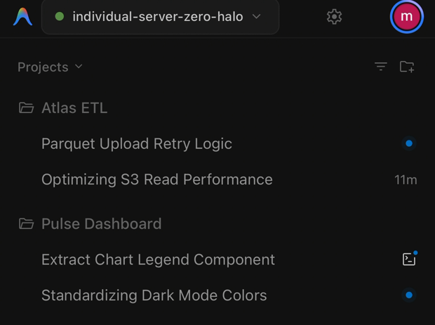
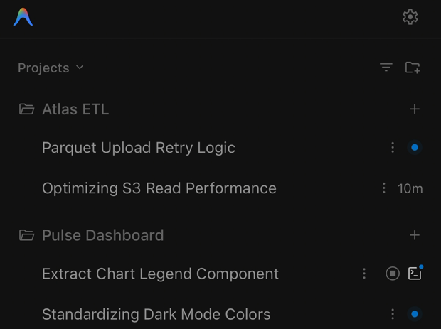
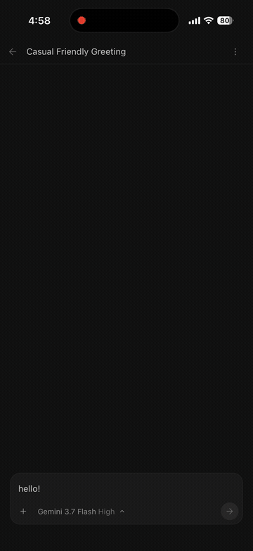

<div align="center">

# Antigravity Server

내 안티그래비티로 들어가는 두 번째 현관.  
모바일 웹 UI를 고치고, UI는 구글 중계를 거치지 않고, 값싼 리눅스 서버에서 알아서 돌아갑니다.

[](https://github.com/AFSlayer/antigravity-server/releases/latest)
[](https://github.com/AFSlayer/antigravity-server/actions/workflows/ci.yml)
[](LICENSE)

| 공식 원격 | 같은 서버, `agy-server` 경유 |
| :---: | :---: |
|  |  |
| 프로젝트에 `+` 없음. 대화에 `⋮` 없음. | 프로젝트별 새 대화, 행마다 삭제 / 이름 변경 / 고정 / 보관. |

<sub>헤드리스 리눅스 서버 한 대, 현관 두 개. 몇 분 간격으로 촬영.</sub>

[English](README.md) · [中文](README.zh-CN.md) · [日本語](README.ja.md) · [Português](README.pt-BR.md) · [Español](README.es.md)

</div>

---

## 왜 Antigravity Server인가? (공식 원격 브릿지 비교)

구글이 `antigravity.google.com`에 공식 원격 브릿지를 내놨습니다. 같은 계정으로 로그인하면 안티그래비티가 켜져 있고 원격 접속이 허용된 내 모든 머신에 닿습니다. **이제 "폰에서 내 에이전트를 쓴다"는 것 자체는 이 프로젝트가 제공할 일이 아니고**, 헤드리스 리눅스 서버도 그 목록에 잡힙니다.

공식 브릿지가 폰으로 내려주는 것은 데스크톱 웹 번들 그대로입니다. `agy-server`의 존재 이유가 여기입니다 — 같은 안티그래비티 코어 앞에 **두 번째 직접 현관**으로 서서, 나가는 번들을 터치로 쓸 수 있게 고쳐 씁니다.

둘은 배타적이지 않습니다. `agy-server`가 켜는 것도 공식 브릿지가 쓰는 `remoteControlEnabled` 설정 하나이므로, 한 머신이 양쪽을 동시에 서빙합니다 — 편한 주소를 쓰면 됩니다.

| | 공식 원격 (`antigravity.google.com`) | Antigravity Server (`agy-server`) |
| :--- | :--- | :--- |
| **모바일 웹 UI** | 데스크톱 번들 그대로 | 터치용 **런타임 패치 25개** |
| **대화 관리** | 모바일에서 삭제·고정·보관 불가 | 케밥 메뉴와 타이틀바에서 **삭제, 이름 변경, 고정, 보관** |
| **프로젝트 이동** | 프로젝트 `(+)` 버튼 없음; 하단 입력창으로 전환 | 프로젝트 목록 헤더에 **`(+)` 버튼 복원** |
| **메시지 액션** | 되돌리기·복사가 호버 뒤에 숨음 | 터치에서 **되돌리기(`↶`)·복사(`📋`) 상시 노출** |
| **iOS 키보드** | 하단 Safe Area 여백 잔류, 포커스 시 뷰포트 출렁임 | 키보드가 열린 동안 Safe Area 축소와 뷰포트 추적 |
| **파일 업로드** | 1MB RPC 텍스트 용량 제한 | 대용량 로그·HAR·데이터셋용 **청크 스트리밍 업로더** |
| **연결 경로** | 구글 서버 중계 | **직접 연결** — 내 도메인, 로컬 네트워크, VPN |
| **구글 계정 없이 접근** | 불가 — 계정이 곧 관문 | 내 비밀번호(PBKDF2), 세션, 레이트 리밋 |

---

## 빠른 시작

### 옵션 1: 리눅스 서버 / 클라우드 VPS (권장)

헤드리스 리눅스 인스턴스(오라클 클라우드 프리티어, AWS, DigitalOcean, 홈 서버 등)에서 실행:

```bash
curl -fsSL https://raw.githubusercontent.com/AFSlayer/antigravity-server/main/scripts/install.sh | bash
```

설치 스크립트 동작 과정:
1. 사용할 도메인(예: `agy.example.com`)과 워크스페이스 경로를 입력받습니다.
2. 구글 공식 빌드 버킷(`storage.googleapis.com`)에서 `language_server` 바이너리를 직접 다운로드합니다. (구글 바이너리를 재배포하지 않습니다.)
3. Caddy 자동 HTTPS 설정, systemd 서비스 등록, 접속 비밀번호 설정을 완료합니다.

#### Google 계정 인증
서버 최초 접속 시:
- **웹 UI에서 직접 로그인**: 브라우저에서 서버 접속 후 **설정(Settings)** 메뉴에서 Google 로그인을 바로 진행합니다.
- **기존 토큰 복사 (선택 사항)**: 이미 로컬 데스크톱에서 로그인한 적이 있다면 토큰을 복사하여 즉시 인증할 수도 있습니다:
  ```bash
  scp ~/.gemini/jetski-standalone-oauth-token user@your-server:~/.gemini/
  ```

---

### 옵션 2: 데스크톱 컴패니언 (macOS, Windows, Linux 데스크톱)

로컬 PC에서 실행 중인 Antigravity를 동일 네트워크의 스마트폰으로 공유:

```bash
# macOS & Linux
curl -fsSL https://raw.githubusercontent.com/AFSlayer/antigravity-server/main/scripts/install-desktop.sh | bash
```

```powershell
# Windows (PowerShell)
irm https://raw.githubusercontent.com/AFSlayer/antigravity-server/main/scripts/install-desktop.ps1 | iex
```

`agy-server`가 QR 코드가 포함된 로컬 제어판을 엽니다. 동일 Wi-Fi에 연결된 스마트폰으로 QR 코드를 스캔하면 비밀번호 입력 없이 즉시 연결됩니다.

<div align="center">

</div>

---

## 모바일 PWA 설정 (홈 화면에 추가)

Antigravity Server는 PWA(Progressive Web App) 규격을 완벽 지원합니다. 모바일 브라우저에서 '홈 화면에 추가'하면 **주소창과 하단 툴바가 없는 전체화면 독립형(Standalone) 앱**으로 실행됩니다:

- **iOS (Safari)**: 하단 **공유 버튼(`⎋`)** 탭 → **'홈 화면에 추가(Add to Home Screen)'** 선택
- **Android (Chrome)**: 우측 상단 **메뉴(`⋮`)** 탭 → **'앱 설치'** 또는 **'홈 화면에 추가'** 선택

> [!TIP]
> 홈 화면 아이콘으로 실행하면 가상 키보드가 올라올 때 브라우저 툴바가 흔들리지 않고 **0px 키보드 밀착 패치**가 완벽하게 동작합니다.

---

## 주요 기능

### ⚡ 모바일 맞춤형 UX 패치
- **터치 액션 버튼**: 내 메시지 말풍선에 되돌리기(`↶`) 및 복사(`📋`) 버튼 상시 노출.
- **완전한 대화 제어**: 상단바 메뉴를 통한 대화 삭제 및 목록 메뉴를 통한 고정(Pin) / 보관(Archive).
- **정밀 가상 키보드 트래킹**: 온스크린 키보드가 올라올 때 Safe Area 여백을 0px로 축소하여 키보드 상단에 완벽 안착.

<div align="center">

</div>

---

### 📁 대용량 파일 청크 스트리밍 업로드
공식 Antigravity는 1MB RPC 용량 제한으로 대용량 파일을 첨부할 수 없습니다. `agy-server`는 청크 스트리밍 업로더를 주입하여 대용량 로그나 데이터셋도 워크스페이스로 직접 전송합니다:

<div align="center">

</div>

---

### 🖥️ 데스크톱 웹 브라우저 접속 화면
스마트폰뿐만 아니라 노트북이나 PC의 일반 데스크톱 웹 브라우저에서도 최적화된 화면으로 접속할 수 있습니다:

<div align="center">

</div>

---

### 🔄 무중단 자동 업데이트 (Auto-Updater)
헤드리스 리눅스 서버에서 `agy-server`는 내장된 백그라운드 자동 업데이트 서비스를 제공합니다:
- 매일 구글 공식 릴리즈 버킷을 확인하여 새로운 `language_server` 버전을 감지합니다.
- 코어 바이너리를 무중단 원자적(Atomic) 방식으로 안전하게 교체합니다.
- 수동 업데이트 확인 및 실행: `agy-server update`

---

### 📝 웹 UI 내 글로벌 & 워크스페이스 룰 편집기
서버 터미널에 직접 접속하지 않고도 웹 브라우저에서 에이전트 지침(`~/.gemini/GEMINI.md`)과 프로젝트 룰을 수정할 수 있습니다:
- **Settings → Customizations → Rules** 메뉴로 이동합니다.
- `user_global` 또는 프로젝트 룰 항목 우측의 **Edit** 버튼을 클릭하여 인라인 에디터를 엽니다.
- 내용 수정 후 **Save Rule 💾**을 클릭하면 호스트 파일시스템에 원자적으로 저장되어 즉시 반영됩니다.

---

## 프로덕션 리버스 프록시 연동 (Caddy / Nginx)

에이전트의 실시간 스트리밍 응답(SSE) 및 WebSocket 통신, 대용량 파일 업로드를 위해 프록시의 **버퍼링 비활성화**와 **WebSocket 업그레이드** 설정이 필요합니다:

### Caddy
```caddyfile
agy.example.com {
    encode zstd gzip

    reverse_proxy 127.0.0.1:8765 {
        flush_interval -1
    }
}
```

### Nginx
```nginx
server {
    listen 443 ssl http2;
    server_name agy.example.com;

    # 대용량 청크 파일 업로드 허용
    client_max_body_size 0;

    location / {
        proxy_pass http://127.0.0.1:8765;
        proxy_http_version 1.1;

        # WebSocket 지원
        proxy_set_header Upgrade $http_upgrade;
        proxy_set_header Connection "upgrade";

        # 실시간 토큰 스트리밍을 위한 버퍼링 비활성화 (필수)
        proxy_buffering off;
        proxy_cache off;
        proxy_read_timeout 86400s;

        # 실제 클라이언트 IP 전달
        proxy_set_header Host $host;
        proxy_set_header X-Real-IP $remote_addr;
        proxy_set_header X-Forwarded-For $proxy_add_x_forwarded_for;
        proxy_set_header X-Forwarded-Proto $scheme;
    }
}
```

> [!IMPORTANT]
> 리버스 프록시 뒤에서 구동할 경우, 무차별 대입 방어(IP 임시 차단)가 올바른 클라이언트 IP를 인식할 수 있도록 `--trusted-proxies 127.0.0.1/32` (또는 환경변수 `AGY_TRUSTED_PROXIES=127.0.0.1/32`)를 설정하세요.

---

## 동작 원리

Antigravity 내부에는 `language_server`라는 독립 바이너리가 포함되어 있습니다. `--standalone` 플래그로 실행하면 로컬 `127.0.0.1`에 웹 인터페이스를 제공합니다.

`agy-server`는 이 바이너리 앞단에서 리버스 프록시로 동작하며 다음을 수행합니다:
- 인증 처리 (PBKDF2 해싱, 쿠키 세션, 무차별 대입 방어).
- 터치 기기를 위한 온더플라이(On-the-fly) JS/CSS 런타임 패치 적용.
- 1MB 제한을 우회하는 대용량 파일 청크 스트리밍 업로드 처리.

```
  스마트폰 / 태블릿 / 노트북 브라우저
                │
                ▼ HTTPS (Port 443 / 8765)
  ┌──────────────────────────────────────────────┐
  │ agy-server (리버스 프록시 및 인증)           │
  │  - PBKDF2 세션 관리 및 속도 제한             │
  │  - 청크 스트리밍 파일 업로더 (/uploads)      │
  │  - 실시간 웹 번들 패치 주입 엔진             │
  └──────────────────────┬───────────────────────┘
                         │ localhost
                         ▼
  ┌──────────────────────────────────────────────┐
  │ language_server --standalone                 │
  │  - 공식 Antigravity 코어 및 에이전트 엔진    │
  │  - 터미널, 파일 트리, 아티팩트, 컴포저      │
  └──────────────────────┬───────────────────────┘
                         │ gRPC
                         ▼
                Google CloudCode API
```

---

## 모바일 UX 패치 상세

공식 원격 브릿지든 `agy-server`든, 안티그래비티가 내려주는 웹 번들은 데스크톱용 하나입니다. `agy-server`는 [`internal/patches/registry.go`](internal/patches/registry.go)의 패치로 그 번들을 지나가는 중에 고쳐 씁니다. 레지스트리에는 42개가 있고 그중 25개가 터치 전용이며, 나머지는 업로드·로그인·캐시 무효화를 담당합니다. 그중 일부:

| 분류 | 데스크톱 번들 기본 동작 | agy-server 패치 동작 |
| :--- | :--- | :--- |
| **네비게이션** | 모바일 화면에서 프로젝트 `(+)` 버튼 숨김 | 프로젝트 행 우측에 `(+)` 새 대화 생성 버튼 복원 |
| **대화 관리** | 터치 환경에서 삭제, 고정, 보관 불가 | `⋮` 메뉴 및 상단바에 삭제, 고정(Pin), 보관(Archive) 추가 |
| **메시지 액션** | 마우스 호버 시에만 버튼 노출 | 말풍선 우측에 되돌리기(`↶`) 및 복사(`📋`) 상시 표시 |
| **가상 키보드** | iOS Safari 뷰포트 출렁임 및 하단 여백 | 키보드 활성화 시 Safe Area 여백을 0px로 즉각 축소 |
| **파일 업로드** | 1MB RPC 용량 제한으로 대용량 파일 실패 | 청크 스트리밍 엔드포인트를 통해 디스크로 직접 전송 |
| **터치 반응** | 300ms 탭 딜레이 및 더블탭 확대 발생 | `touch-action: manipulation`으로 즉각적인 터치 반응 보장 |
| **입력 방식** | 모바일 엔터 입력 시 줄바꿈 대신 즉시 전송 | 엔터는 줄바꿈, 전송 버튼 및 Cmd/Ctrl+Enter로 전송 |
| **모델 선택** | 모델 탭 시 메뉴가 바로 닫히는 현상 | 모델 탭 시 reasoning effort 서브메뉴 정상 오픈 |

`agy-server doctor` 명령어로 설치된 번들에 대한 패치 무결성을 진단할 수 있습니다.

---

## CLI 명령어

```
agy-server                      데스크톱 컴패니언 모드로 실행 (로컬 네트워크)
agy-server serve                헤드리스 서버 데몬으로 백그라운드 구동
agy-server update               구글 공식 최신 language_server 확인 및 업그레이드
agy-server doctor               패치 무결성 및 시스템 상태 진단
agy-server passwd [password]    웹 접속 비밀번호 설정 및 변경
agy-server sessions [revoke]    활성 세션 목록 조회 또는 모든 기기 로그아웃
agy-server config [flags]       config.json 설정값 관리
```

모든 CLI 플래그는 `AGY_` 접두사가 붙은 환경 변수로도 지정할 수 있습니다 (예: `AGY_PORT=8765`, `AGY_PUBLIC_URL=https://agy.example.com`).

---

## 보안

- **비밀번호 보호**: PBKDF2-SHA256 (200,000회 반복 연산) 단방향 해싱.
- **세션 토큰**: 256비트 암호학적 난수 토큰 사용, 디스크에는 SHA-256 해시만 저장.
- **무차별 대입 방어**: 5회 이상 로그인 실패 시 IP 임시 잠금 (5분~30분).
- **업로드 격리**: 파일 업로드는 지정된 프로젝트 디렉토리 내부로 엄격히 제한되며 경로 조작(`../`) 시도는 즉시 차단됩니다.
- **신뢰할 수 있는 프록시**: Nginx, Caddy, Cloudflare 뒤에서 구동할 경우 `--trusted-proxies`를 지정하여 헤더 위조를 방어합니다.

---

## 자주 묻는 질문 (FAQ)

**구글이 공식 원격을 내놨는데도 이게 필요한가요?**  
공식 모바일 웹 UI가 불편하거나, 구글 서버를 중계로 쓰지 않고 내 비밀번호로 접근을 통제하고 싶을 때만 필요합니다. 한 머신에서 양쪽을 동시에 쓸 수 있고, 이 프로젝트가 공식 브릿지를 끄지도 않습니다.

**리눅스에 Antigravity 데스크톱 GUI 프로그램이 설치되어 있어야 하나요?**  
아닙니다. `agy-server`는 GUI 없이 코어 `language_server` 바이너리만 독립적으로 구동합니다.

**구글이 Antigravity를 업데이트하면 패치가 깨지나요?**  
패치는 단순 변수명이 아닌 AST 구조 패턴을 매칭하는 적응형 정규식을 사용합니다. `agy-server update`를 실행하면 공식 업데이트를 안전하게 반영할 수 있습니다.

**내 코드가 제3자 서버를 경유하나요?**  
아닙니다. 모든 트래픽은 사용자의 브라우저와 서버 인스턴스 간에 직접 암호화 통신됩니다. 외부 통신은 `language_server`가 구글 공식 API와 통신하는 것이 유일합니다.

---

## 라이선스

[Apache-2.0](LICENSE). Not affiliated with or endorsed by Google. See [DISCLAIMER.md](DISCLAIMER.md).
